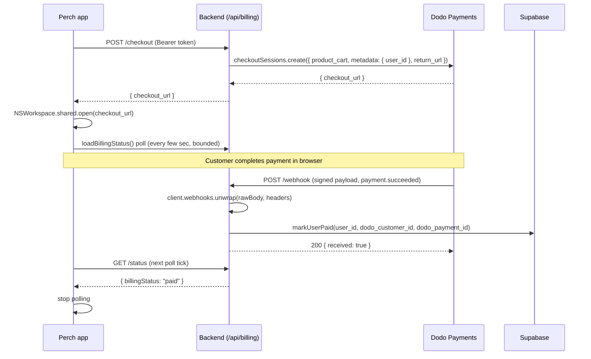

# Dodo Payments Checkout and Webhook Integration - Plan

## Goal Capsule

- **Objective:** Turn the existing "Buy $5" UI into a working one-time-purchase flow: `POST /api/billing/checkout` creates a real Dodo Payments checkout session, and a new webhook endpoint verifies and processes the resulting payment to permanently unlock the app for that user.
- **Authority hierarchy:** This plan's Key Technical Decisions govern implementation choices; Dodo Payments' official SDK types and API reference are authoritative for exact request/response shapes and must not be guessed or approximated; repo conventions in `AGENTS.md` govern anything this plan doesn't specify.
- **Stop conditions:** Stop and raise a question if the `dodopayments` SDK's actual TypeScript types diverge materially from what's described in Planning Contract / Implementation Units, or if webhook signature verification cannot be made to pass in testing — do not ship a bypassed or `unsafe_unwrap`-based verification path.
- **Execution profile:** `code`, Standard depth, 5 implementation units, no phased milestones.
- **Tail ownership:** The implementer runs the manual verification steps in the Verification Contract themselves (dashboard test-mode purchase, `dodo wh listen`/`dodo wh trigger`); this repo has no automated test runner to own that tail.

---

## Product Contract

### Summary

Replace the stubbed `/api/billing/checkout` endpoint with a real Dodo Payments checkout session, add a signature-verified webhook endpoint that marks a Supabase user as paid on successful payment, and add a bounded status-poll on the Swift side so the app reflects the purchase without a manual restart. This stays a one-time $5 lifetime unlock — no subscriptions.

### Problem Frame

`entitlements.ts` already tracks a 14-day trial and a `paid` billing state, and the Swift app already calls `startCheckout()` and opens whatever `checkout_url` the backend returns — but the backend's `/checkout` route is a stub that always responds 501/503, and no webhook exists to ever set `billing_status='paid'`. The Supabase schema (`backend/sql/001_billing_entitlements.sql`) already has the columns needed (`lifetime_purchased_at`, `dodo_customer_id`, `dodo_payment_id`, `billing_status`); this plan is the missing link between "schema and UI exist" and "a real purchase actually unlocks the app."

### Requirements

**Checkout and entitlement**

- R1. `POST /api/billing/checkout` creates a real Dodo one-time checkout session for the configured $5 product and returns `checkout_url` in the shape the app already expects, or a clear 503 when Dodo isn't configured.
- R2. A verified `payment.succeeded` webhook event permanently marks the paying user's Supabase profile as paid (`billing_status`, `lifetime_purchased_at`, `dodo_customer_id`, `dodo_payment_id`), overriding trial state per the existing precedence in `entitlements.ts`.

**Security and reliability**

- R3. Webhook requests are cryptographically verified (HMAC, Standard Webhooks spec) before any entitlement write; unverified or malformed requests are rejected and never change billing state.
- R4. Duplicate or retried webhook deliveries for the same payment do not double-process or corrupt entitlement state.

**App-side reflection**

- R5. After completing checkout, the app automatically re-checks billing status for a bounded window so a successful purchase shows up without a manual restart or requiring the user to press the existing manual "Refresh" button.

### Scope Boundaries

In scope: one-time $5 checkout session creation, webhook verification and processing for `payment.succeeded`/other event types, Supabase entitlement writes, a cosmetic return-url page, and bounded Swift-side status polling.

#### Deferred to Follow-Up Work

- Subscriptions or recurring billing (Dodo supports it; this integration stays one-time-purchase only).
- Refund/dispute handling and any related UI.
- A dedicated webhook-event ledger/audit table (idempotency here relies on comparing `dodo_payment_id`, which is sufficient for one purchase per user; a ledger would matter more at higher event volume or multi-event-per-user scale).
- Receipt/confirmation emails and an admin override UI for manually granting access.

Out of scope entirely: embedded/overlay/inline checkout (this plan keeps the existing hosted-redirect flow the app already opens via `NSWorkspace`), and multi-currency/tax customization beyond Dodo's defaults.

### Dependencies

- Dodo Payments dashboard access to create the $5 product, generate API keys, and configure the webhook endpoint (see Operational Notes) — required before this plan's endpoints can be exercised end-to-end.
- Existing Supabase columns from `backend/sql/001_billing_entitlements.sql` (already applied).

---

## Planning Contract

### Key Technical Decisions

- **Official SDK for both checkout and webhooks.** Use the `dodopayments` npm package for creating checkout sessions and for verifying webhook signatures via its `webhooks.unwrap()` helper. It implements the Standard Webhooks HMAC verification and typed checkout-session request/response shapes, avoiding a hand-rolled crypto path.
- **Raw body ahead of the global JSON parser.** `index.ts` currently applies `app.use(express.json())` globally before any routes are mounted. `unwrap()` needs the exact raw request bytes to verify the signature, so the webhook path is given its own `express.raw({ type: 'application/json' })` middleware registered before the global `express.json()` call, scoped only to `/api/billing/webhook`.
- **Webhook is the sole source of truth for entitlement writes.** The `return_url` page (`GET /api/billing/return`) only renders a static "you can close this tab" page, mirroring `routes/apps.ts`'s `/callback` HTML pattern — it never writes to the database, since return-url query parameters are client-controlled and not cryptographically verifiable for checkout sessions.
- **Idempotency via payment-id comparison, not a ledger table.** Before writing paid state, compare the incoming `payment_id` against the profile's already-stored `dodo_payment_id`; a match means the event was already processed and the write is skipped (still returns 200). Dodo's docs recommend the `webhook-id` header as the general idempotency key for this exact reason (retries reuse it); this plan uses `payment_id` instead because the scope is narrower — one paid unlock per user, ever — so comparing the payment identifier already stored on the profile gives the same practical guarantee without a separate ledger. A ledger keyed on `webhook-id` is the natural upgrade path if this integration later needs per-event (not per-user) idempotency (see Scope Boundaries).
- **Checkout metadata carries the user id.** `metadata: { user_id }` set at checkout-session creation is the only mechanism the webhook uses to resolve which Supabase user to mark paid — no new lookup table. This is also why checkout uses the dynamic Checkout Sessions API rather than a static Dodo Payment Link: a static link is reused across customers and can't carry unique per-checkout metadata, so it can't tell the webhook which user paid.
- **Never ship `unsafe_unwrap()`.** Dodo's SDK offers `unsafe_unwrap()` for parsing without verification (intended for the CLI's own mock-payload testing). The shipped webhook handler always uses `unwrap()`; local testing instead uses `dodo wh listen` to forward real, signed test-mode events.
- **Swift polls rather than pushes.** After `startCheckout()` opens the browser, a bounded `Timer`-based poll (mirroring `StatsPanel.swift`'s `Timer.scheduledTimer` pattern) re-calls the existing `loadBillingStatus()` every few seconds until paid or a timeout. No new WebSocket/push plumbing between the backend and the desktop app for this.
- **No new test runner.** `AGENTS.md` states no package in this repo has unit tests today. This plan does not introduce one; verification is manual/integration testing against Dodo's test mode (dashboard test purchases, `dodo wh listen`, `dodo wh trigger`), plus the existing `tsc`/`swift build` compile checks.

### High-Level Technical Design



### Assumptions

- The $5 one-time product, API key, and webhook secret are created in the Dodo dashboard by the user (or with guided help — see Operational Notes) and supplied via the existing `DODO_PAYMENTS_*` env vars already read by `config.ts`; this plan does not create the product programmatically.
- `req.user.email` (from Supabase auth) is an acceptable value to prefill the checkout session's customer email; no separate customer-lookup step is needed.
- "Perch" (used in the sequence diagram and dashboard product name) is the app's product/executable name; Supabase tables keep the historical `danotch_` prefix from the project's original codename. This is a pre-existing repo-wide naming artifact, not something this plan changes.

---

## Implementation Units

### U1. Dodo Payments SDK dependency and client helper

- **Goal:** Add the official SDK and a single shared client instance so checkout and webhook code share env-var checks instead of duplicating them.
- **Requirements:** R1, R2, R3
- **Dependencies:** none
- **Files:** `backend/package.json`, `backend/src/billing/dodo-client.ts` (new)
- **Approach:** Add `dodopayments` as a dependency. New module exports a lazily-constructed singleton client (bearer token + environment from `config.dodo`) plus small boolean helpers (`isCheckoutConfigured()`, `isWebhookConfigured()`) that replace the ad hoc env-var checks currently inlined in `routes/billing.ts`.
- **Patterns to follow:** `backend/src/lib/supabase.ts`'s singleton-client pattern; `config.ts` remains the single source of truth for env var names.
- **Test scenarios:** Test expectation: none -- pure dependency and config wiring with no independent behavior; covered by the build check in Verification.
- **Verification:** `cd backend && npm install && npm run build` succeeds and resolves the new import.

### U2. Real checkout session creation endpoint

- **Goal:** Replace the stub in `POST /api/billing/checkout` with a real Dodo checkout session, returning `checkout_url` in the shape the Swift app already expects.
- **Requirements:** R1
- **Dependencies:** U1
- **Files:** `backend/src/routes/billing.ts`
- **Approach:** Keep `requireAuth` and the existing 503 gate for missing config (now backed by U1's helper). If `getBillingStatus(userId).billingStatus === 'paid'`, short-circuit with 200 and a message instead of creating a new session. Otherwise call `checkoutSessions.create` with the configured product, `customer.email` from `req.user`, `metadata: { user_id }`, and `return_url: config.dodo.returnUrl`; respond `{ checkout_url }`. Add `GET /api/billing/return` rendering a static thank-you HTML page for `DODO_PAYMENTS_RETURN_URL` to point at.
- **Patterns to follow:** `routes/apps.ts`'s HTML success-page markup/styling for the return page; the existing `{ error, code }` error-response shape.
- **Test scenarios:**
  - Happy path: authenticated user with `requiresPurchase=true` and valid Dodo config gets 200 with a non-empty `checkout_url`.
  - Already-paid short-circuit: authenticated user whose `billingStatus.billingStatus === 'paid'` gets 200 without a Dodo API call.
  - Missing config (`DODO_PAYMENTS_API_KEY`/`PRODUCT_ID`/`RETURN_URL` unset) still returns 503 `checkout_not_configured`.
  - Dodo API failure (invalid product id, network error) returns a generic 5xx error, not a raw stack trace or thrown exception.
  - `GET /api/billing/return` renders 200 HTML for any query params, with no auth requirement and no DB write.
- **Verification:** Run a test-mode checkout via the Dodo dashboard's test card flow; confirm the returned `checkout_url` opens a real Dodo hosted checkout page.

### U3. Entitlements: paid-write helper and idempotency guard

- **Goal:** Centralize the "mark this user paid" write and its duplicate-payment guard in `entitlements.ts`, matching how that file already owns every `billing_status` write.
- **Requirements:** R2, R4
- **Dependencies:** none
- **Files:** `backend/src/billing/entitlements.ts`
- **Approach:** Add `markUserPaid(userId, { dodoCustomerId, dodoPaymentId })`. It reads the profile's current `dodo_payment_id`; if it already matches the incoming payment id, it returns without writing (`alreadyProcessed: true`). Otherwise it sets `billing_status='paid'`, `lifetime_purchased_at=now()`, `dodo_customer_id`, `dodo_payment_id` and returns `alreadyProcessed: false`.
- **Patterns to follow:** `getBillingStatus`'s existing Supabase read/update shape in the same file.
- **Test scenarios:**
  - Happy path: profile with no prior `dodo_payment_id` gets all four columns set and `alreadyProcessed: false`.
  - Duplicate: profile whose `dodo_payment_id` already matches the incoming id gets no write and `alreadyProcessed: true`.
  - Unknown user id: surfaces a clear error rather than silently no-op-ing.
  - Mid-trial purchase: a user still inside their 14-day trial who purchases ends up with `getBillingStatus` reporting `'paid'`, not `'trialing'` (paid takes precedence in the existing logic).
- **Verification:** Exercised indirectly through U4's webhook test scenarios; no standalone test file given this repo's no-test-runner convention.

### U4. Webhook endpoint with signature verification

- **Goal:** Receive Dodo's payment webhooks, verify authenticity, and call `markUserPaid` on success.
- **Requirements:** R2, R3, R4
- **Dependencies:** U1, U3
- **Files:** `backend/src/routes/billing.ts`, `backend/src/index.ts`
- **Approach:** In `index.ts`, register `app.use('/api/billing/webhook', express.raw({ type: 'application/json' }))` before the existing global `app.use(express.json())` line so the webhook path keeps its raw body. In `billing.ts`, add `POST /webhook` (no `requireAuth` — Dodo is the caller, not a logged-in user). First check `isWebhookConfigured()` (from U1); if false, respond 503 immediately, mirroring the checkout gate — no signature verification is attempted against an unconfigured secret. Only when configured does the handler read the raw body, call `client.webhooks.unwrap(rawBody.toString(), { headers: {...} })`, and on verification failure return 401 without touching the DB. On success, switch on `payload.type`: `payment.succeeded` extracts `payload.data.metadata.user_id`, `payload.data.payment_id`, and `payload.data.customer.customer_id`, then calls `markUserPaid`. If `markUserPaid` fails because `user_id` doesn't match any Supabase profile, log the failure at error level with the `payment_id` and `user_id` for manual reconciliation, and still return 200 — retrying won't resolve an unknown-user mismatch, so acking prevents an infinite Dodo retry loop; any other event type is logged and acknowledged without a DB write. The Supabase update is fast enough to run inline within Dodo's 15-second webhook timeout — no async-ack pattern needed.
- **Patterns to follow:** `routes/apps.ts`'s unauthenticated `/callback` route as the precedent for a public route that trusts a verified external payload instead of a bearer token.
- **Technical design (directional):**
  ```
  POST /api/billing/webhook (raw body)
    -> client.webhooks.unwrap(rawBody, headers)   // throws on bad signature
    -> switch (payload.type)
         payment.succeeded -> markUserPaid(metadata.user_id, {...})
         payment.failed    -> log only
         default            -> log only
    -> 200 { received: true }
  ```
- **Test scenarios:**
  - Happy path: valid `payment.succeeded` payload with correct signature and `metadata.user_id` matching a real profile marks that profile paid and returns 200.
  - Invalid signature: tampered payload or wrong secret makes `unwrap()` throw; endpoint returns 401 with no DB write.
  - Missing/malformed headers (`webhook-id`/`webhook-signature`/`webhook-timestamp` absent) returns 400/401 with no DB write.
  - Duplicate delivery: the same `payment_id` delivered twice is a no-op on the second delivery via U3's idempotency guard, and still returns 200.
  - Unrelated event type (e.g. `payment.failed`) returns 200 acknowledged with no entitlement change.
  - Missing `metadata.user_id` on an otherwise-valid `payment.succeeded` payload is logged and acknowledged (200) rather than throwing an unhandled error.
  - Unmatched `metadata.user_id` (present but doesn't match any Supabase profile) is logged at error level with the `payment_id` and `user_id`, and acknowledged (200) rather than retried by Dodo.
  - Missing webhook config (`DODO_PAYMENTS_WEBHOOK_KEY` unset) returns 503 before any signature verification is attempted.
- **Verification:** Use `dodo wh listen` to forward real, signed test-mode webhook events to `http://localhost:3001/api/billing/webhook` during local development, or complete a full test-mode purchase via the dashboard; confirm signature verification succeeds and the Supabase row updates. If `dodo wh listen` is unavailable, an alternative is to expose the local backend via a tunnel (e.g. ngrok) and register that tunnel URL as a temporary test-mode webhook endpoint in the Dodo dashboard; `dodo wh trigger` can validate handler routing logic with unsigned payloads but does not exercise signature verification. Never rely on `unsafe_unwrap()` in the shipped handler.

### U5. Swift: post-checkout billing status polling

- **Goal:** Reflect a completed purchase in-app without requiring a manual restart or the existing manual "Refresh" button.
- **Requirements:** R5
- **Dependencies:** U2
- **Files:** `app/Sources/NotchViewModel.swift`
- **Approach:** Add `checkoutPollTimer` and an attempt counter. In `startCheckout()`, after `NSWorkspace.shared.open(url)` succeeds, start a repeating `Timer` (interval and attempt cap tuned during implementation, in the range of `StatsPanel`'s 2-second cadence for a total window of roughly one to two minutes) that calls the existing `loadBillingStatus()`. Inside `loadBillingStatus()`'s success branch, stop and invalidate the timer once `parsed.billingStatus == "paid"`, and also invalidate once the attempt cap is reached. Invalidate any existing timer before starting a new one so repeated "Buy $5" taps never leak timers.
- **Patterns to follow:** `StatsPanel.swift`'s `Timer.scheduledTimer(withTimeInterval:repeats:)` with `[weak self]`; the existing `loadBillingStatus()` call sites after provider changes in `NotchViewModel.swift` as precedent for "re-check billing status after an action."
- **Test scenarios:**
  - Happy path: `startCheckout()` opens the browser and polling begins; once a test purchase completes and the webhook processes, the next poll tick reflects `billingStatus: "paid"` and polling stops.
  - Timeout: checkout is never completed; polling stops after the attempt cap without a dangling timer.
  - Rapid re-entry: tapping "Buy $5" twice in a row leaves only one active poll timer.
  - Backgrounded/collapsed notch: polling continues (it's ViewModel-level, not tied to view lifecycle) and the badge updates correctly once the notch is reopened.
- **Verification:** Run a full test-mode purchase with the app open; observe the billing section's badge flip from "TRIAL"/"EXPIRED" to "PAID" without restarting the app, within the polling window.

---

## Verification Contract

| Check | Command / Method | Applies to |
|---|---|---|
| Backend type-check | `cd backend && npm run build` | U1, U2, U3, U4 |
| Swift build | `cd app && swift build` | U5 |
| Signed webhook delivery (local) | `dodo wh listen` forwarding to `localhost:3001/api/billing/webhook` | U4 |
| Mock webhook payloads (local, unsigned) | `dodo wh trigger` — informational only, does not exercise signature verification | U4 |
| Full end-to-end purchase | Dodo dashboard test-mode checkout with a test card | U2, U3, U4, U5 |

This repo has no automated unit-test runner (`AGENTS.md`); the checks above are the closest available substitute — a compile/type-check gate plus manual/integration verification against Dodo's test mode.

## Definition of Done

- `npm run build` (backend) and `swift build` (app) both succeed with no new errors.
- A full test-mode purchase updates `danotch_user_profiles` (`billing_status='paid'`, `lifetime_purchased_at`, `dodo_customer_id`, `dodo_payment_id`) and the app reflects "paid" without a restart, within the polling window.
- A forged or invalid-signature webhook request is rejected with 401 and never alters billing state.
- A duplicated webhook delivery for the same `payment_id` does not double-process.
- No leftover experimental code from approaches not taken (no `unsafe_unwrap()` in the shipped handler, no abandoned raw-fetch webhook prototype if the SDK path is used instead).

---

## Risks & Dependencies

- **Webhook secret misconfiguration.** A missing or wrong `DODO_PAYMENTS_WEBHOOK_KEY` either blocks all verification (fails closed, 401 — safe) or, if leaked, could let a forged payload mark an account paid. Mitigation: verification always runs (KTD "Never ship `unsafe_unwrap()`"), and the webhook route 503s if the key isn't configured, mirroring the existing checkout gate.
- **No public HTTPS endpoint in local development.** Dodo can't reach `localhost` directly. Mitigation: use `dodo wh listen` for local testing (see Operational Notes).
- **Test mode and live mode are fully separate.** Per Dodo's docs, API keys, products, and webhooks created in test mode do not carry over to live mode — each must be created independently. Mitigation: Operational Notes below spell out both.
- **Payment-id idempotency doesn't generalize past one purchase per user.** If this integration ever adds a second purchasable one-time product (not currently planned), comparing against a single `dodo_payment_id` column would need to become per-product or move to a `webhook-id`-keyed ledger (see KTD above) — flagged here so a future change to Scope Boundaries doesn't quietly break idempotency.

## Documentation / Operational Notes

Manual dashboard setup required before this integration can be exercised (test mode first, then repeated for live mode when ready to accept real payments):

1. Go to the [Dodo Payments dashboard](https://app.dodopayments.com/) and switch to Test Mode.
2. **Developer > API** — generate an API key, copy it into `DODO_PAYMENTS_API_KEY`.
3. Create a one-time product ("Perch Lifetime Unlock", $5.00), copy its product id into `DODO_PAYMENTS_PRODUCT_ID`.
4. **Developer > Webhooks** — add an endpoint pointing at `<public-backend-host>/api/billing/webhook`. During local development, there is no public host yet: use the Dodo CLI's `dodo wh listen` to forward test-mode webhook events to `http://localhost:3001/api/billing/webhook` instead of registering a dashboard endpoint. Once deployed, register the real public URL and select the `payment.succeeded` and `payment.failed` events; copy the webhook secret into `DODO_PAYMENTS_WEBHOOK_KEY`.
5. Set `DODO_PAYMENTS_RETURN_URL` to `<public-backend-host>/api/billing/return` (the page added in U2).
6. Set `DODO_PAYMENTS_ENVIRONMENT=test_mode` while testing. When ready for real payments, repeat steps 2-5 in Live Mode with newly generated live keys, a live product, and a live webhook endpoint — none of these carry over from test mode — then flip `DODO_PAYMENTS_ENVIRONMENT=live_mode`.

## Open Questions

- **What does the $5 lifetime unlock actually change relative to the existing BYOK/trial model?** (product-lens, confidence 75) The Summary and Requirements describe unlocking the app permanently after payment, but don't state what a paying user gains that a BYOK user (who supplies their own provider key) or an active-trial user doesn't already have. Worth clarifying before implementation so the checkout copy/return page and any future pricing page describe the right value proposition — flagged here rather than fixed because it's a product/business judgment call, not a technical gap.
