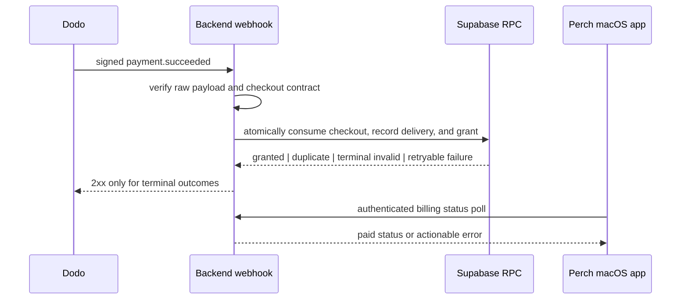
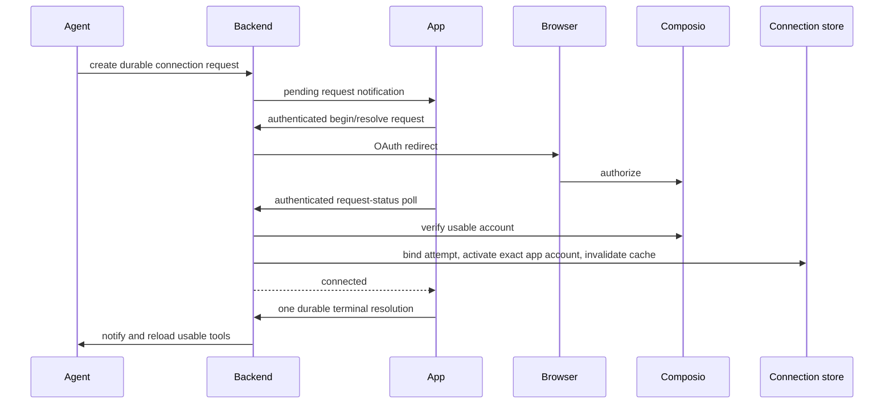

# fix: remediate production smoke-test failures

## Summary

Repair the concrete payment, OAuth, authenticated-client, interaction, and marketing-site defects found by the end-to-end smoke audit. Preserve **Perch** on the active site, release artifacts, and public links; retain existing internal identifiers unless a later, deliberate rename is approved. Make visible controls truthful: functional when the product supports the action, unavailable when it does not.

## Problem Frame

The backend currently permits payment entitlement failures to be acknowledged, lacks complete commercial validation, and can consume the trial provider for unauthenticated chat. OAuth success can appear in the UI without becoming available to future agent runs. The app can retain stale request state after failures, while several visible controls have no underlying action. The active marketing surface also has broken release paths and a failing lint gate.

---

## Requirements

### Payment and access control

- R1. A signed `payment.succeeded` event may grant an entitlement only when it matches the configured Perch product, exact amount, and currency.
- R2. The first accepted payment must transition a profile with no payment ID to `paid` exactly once; duplicate delivery must not mutate the original entitlement.
- R3. Unknown profiles and deliberately ineligible verified events must not grant access; transient persistence failures must remain retryable rather than being acknowledged as successful.
- R4. Chat must require an authenticated account before creating a task, resolving a provider, exposing tools, or consuming the server trial key.
- R5. Billing routes must distinguish missing profiles from operational failures so a valid macOS session is not logged out for a transient backend error.
- R6. A payment must match a server-created, unexpired checkout record for the authenticated purchaser before it can grant an entitlement.

### OAuth and external actions

- R7. A verified usable Composio connection must match a server-owned user/app connection attempt before becoming active, invalidate the active-app cache, and be available in both the current and later chats.
- R8. Reconnect and reset operations must be app-scoped, preserve a working connection when a replacement fails, and never activate pending or failed accounts.
- R9. Connection requests must survive app/backend reconnects, enforce requester ownership and expiry, and permit one terminal decision.
- R10. A draft action must have a backend-issued opaque approval ID, immutable action payload, and one terminal decision; approval executes via a stable idempotency key when the downstream action supports one, otherwise uses at-most-once attempt semantics with reconciliation.

### macOS client integrity

- R11. Every authenticated billing, provider, connection, schedule, notification, draft, and chat request must refresh credentials first and surface a non-success response without committing stale local state.
- R12. Connection approval or denial must be persisted and displayed after a reload; the app must resolve one durable backend request rather than race independent polling loops.
- R13. Notification read transitions must handle empty bodies, concurrent WebSocket inserts, and failed server writes without an incorrect unread count.
- R14. Agent monitoring remains a local persisted preference. Remove the non-enforceable local-tool consent control unless it is replaced by a server-owned per-user policy enforced by the runner; macOS notification consent must produce local notifications for supported events.

### Site and quality gates

- R15. Perch is the public product name; all rendered source and release CTAs must target real Perch destinations.
- R16. The selected production site composition must have no missing static assets, dead visible controls, or excluded unchecked code.
- R17. Backend, app, and site behavior introduced by this remediation must have automated regression coverage, and the site lint/build gates must pass.
- R18. OAuth identifiers and pending-action audit data must be owner-scoped, minimized, redacted or encrypted where content is sensitive, and removed or revoked on disconnect according to a documented retention policy.

---

## Key Technical Decisions

- **Strict commercial contract:** Create a server-owned checkout record for the authenticated user before Dodo checkout creation, then require the verified delivery to match its user, Dodo reference, configured product/quantity/amount/currency, environment, and expiry. This intentionally rejects discounted or changed-price checkouts until operators update the deployment configuration.
- **Durable payment recording:** Use a database RPC/transaction to atomically consume the checkout record, record the verified delivery/payment, and grant the entitlement. The function must use null-safe comparison and return explicit outcomes for new, duplicate, unknown-profile, cross-account, stale-checkout, and conflict cases.
- **Authentication is mandatory for chat:** Replace optional identity extraction on the chat route with `requireAuth`; only the authenticated entitlement resolver may select the server trial key or a BYOK provider.
- **Status polling is the trusted OAuth sync point:** Browser callback query parameters remain display-only. The authenticated status route confirms a usable Composio account bound to an unexpired server-owned connection attempt, synchronizes the exact account to the database, and invalidates cached active apps.
- **Connection resolution is durable REST state:** Persist connection requests and attempts. The app initiates OAuth through an authenticated request, polls the durable request state, and resolves it once; WebSocket events notify the agent but do not become the source of truth.
- **Drafts are pending actions, not formatted messages:** Introduce an explicit backend-owned pending-action lifecycle using authenticated REST approve/reject endpoints. Store a canonical immutable allowlisted action payload, render its security-relevant fields, revalidate ownership/connection at execution, and never expose raw OAuth tokens.
- **Downstream execution is honest about guarantees:** Pass the pending-action ID as an idempotency key where a supported Composio operation accepts one. Otherwise move the action to `executing` before the call, do not automatically replay ambiguous failures, and require reconciliation.
- **One client request path:** Centralize authenticated URLSession behavior around refresh, response decoding, and error mapping, then apply reducers/rollback only after the server outcome is known.
- **One shipped Perch site:** Retain the active `PerchSite` composition, centralize release/source URLs, and remove or quarantine unused V7 code rather than maintaining two divergent landing pages.

---

## High-Level Technical Design

---

## Scope Boundaries

### In scope

- All concrete defects identified by the completed smoke, correctness, and security reviews across `backend/`, `app/`, and the active Perch site.
- Test infrastructure needed to prevent regressions in these flows.
- Deployment documentation for mandatory payment contract and provider-key configuration.

### Deferred to Follow-Up Work

- Refund, chargeback, and subscription-revocation entitlement policies.
- A separate payment ledger, analytics dashboard, or manual reconciliation UI beyond audit data needed for this flow.
- New marketing layouts or an internal-identifier rename.

---

## Implementation Units

### U1. Establish regression harnesses and shared contracts

- **Goal:** Add focused test seams before modifying security-sensitive flows.
- **Requirements:** R1–R18.
- **Dependencies:** None.
- **Files:** `backend/package.json`, `backend/tsconfig.json`, `backend/src/**/*.test.ts`, `app/Tests/PerchTests/`, `site/package.json`, `site/src/**/*.test.tsx`, `site/playwright.config.ts`, `site/tests/`.
- **Approach:** Add a TypeScript test runner and route/service dependency seams for backend tests, expand the existing XCTest target for pure reducers/view-model helpers, and add site component/browser smoke coverage. Keep integration tests capable of using a test Supabase project and Dodo signed test deliveries rather than relying solely on mocks.
- **Execution note:** Start with failing tests for the first-payment, unauthenticated-chat, OAuth-persistence, and visible-CTA regressions.
- **Patterns to follow:** `app/Tests/PerchTests/WidgetGridLayoutTests.swift`; existing package scripts.
- **Test scenarios:**
  - A focused backend service test can run without a production key or production database.
  - A Dodo test-mode integration suite is opt-in and cannot target the live product.
  - Site checks fail for a broken active CTA, missing public asset, or lint violation.
- **Verification:** Test commands are documented and execute in CI/local development without accessing production credentials.

### U2. Make payment entitlement grants strict, atomic, and retry-safe

- **Goal:** Bind a verified configured payment to its purchaser, grant paid status once, and retain retry behavior for operational failures.
- **Requirements:** R1–R3, R5, R6, R18.
- **Dependencies:** U1.
- **Files:** `backend/src/billing/entitlements.ts`, `backend/src/billing/dodo-client.ts`, `backend/src/config.ts`, `backend/src/routes/billing.ts`, `backend/sql/002_payment_entitlement_events.sql`, `backend/scripts/apply-billing-schema.mjs`, `backend/.env.example`, `backend/src/billing/**/*.test.ts`, `backend/src/routes/**/*.test.ts`, `README.md`.
- **Approach:** Keep raw-body SDK verification. Persist a server-created checkout record before Dodo session creation and replace the null-unsafe profile update with an RPC that atomically consumes the matching checkout, stores a deduplicated delivery/payment record, and changes the profile only for the first eligible payment. The event table stores claimed user ID separately from any nullable profile reference so unknown users can be audited without a foreign-key failure. Validate product cart, quantity, configured amount, currency, environment, metadata, and Dodo reference before the RPC. Separate terminal reconciliation outcomes from retryable database failures; return a non-2xx status for the latter. Replace the single-file migration script with an ordered, recorded migration runner and make migration application/schema verification a pre-deploy gate.
- **Patterns to follow:** `backend/src/routes/billing.ts`, `backend/sql/001_billing_entitlements.sql`, `docs/plans/2026-07-03-001-feat-dodo-payments-checkout-plan.md`.
- **Test scenarios:**
  - A signed configured first payment against `NULL dodo_payment_id` grants paid status and records the immutable first payment.
  - Duplicate delivery is acknowledged without a second mutation.
  - Wrong/missing product cart, amount, currency, metadata, checkout reference, signature, or event type never grants access.
  - A valid payment cannot consume another account’s checkout record; an expired or consumed checkout cannot grant access.
  - Unknown user is recorded as a terminal reconciliation outcome; a database failure returns retryable status.
  - Billing status distinguishes absent profile from a database outage.
- **Verification:** Ordered migrations apply exactly once to a clean target and are verified before deploy. A signed Dodo test-mode delivery transitions an eligible test user once and Swift sees paid status on its next bounded poll.

### U3. Enforce authenticated chat and complete the Composio lifecycle

- **Goal:** Remove anonymous provider consumption and make OAuth-connected apps durable, bound, and usable across conversations.
- **Requirements:** R4, R7–R9, R18.
- **Dependencies:** U1.
- **Files:** `backend/src/routes/tasks.ts`, `backend/src/agent/runner.ts`, `backend/src/routes/apps.ts`, `backend/src/composio/connection.ts`, `backend/src/composio/tools.ts`, `backend/src/types.ts`, `backend/sql/003_connection_requests.sql`, `backend/src/**/*.test.ts`.
- **Approach:** Require authentication before dispatching chat and return stable request-level error contracts for identity/entitlement denial. Persist owned, app-scoped connection requests and short-lived connection attempts before initiating OAuth. Model Composio connection lifecycle explicitly: begin only after validating configuration, accept only usable account states bound to the attempt, synchronize from trusted authenticated status polling, invalidate cache after activation, and scope reset/disconnect to the requested app/account. Persist one atomic terminal request resolution and replay current state after reconnect. Avoid logging OAuth tokens or account capability details; delete/revoke stored identifiers as part of app-scoped disconnect.
- **Patterns to follow:** `backend/src/middleware/auth.ts`, `backend/src/composio/connection.ts`, `backend/src/events/notch.ts`.
- **Test scenarios:**
  - Missing, malformed, or expired chat auth returns 401 before task/provider/tool work begins.
  - Trial, paid-without-BYOK, and BYOK accounts follow the documented provider outcomes.
  - Redirect OAuth status synchronizes one active app account and makes tools available in a new chat.
  - Pending/failed accounts do not become active; failed reconnect preserves a working account.
  - An expired, mismatched, or cross-user OAuth attempt cannot activate an account.
  - Resetting one app cannot remove another app’s connection, and disconnect prevents subsequent tool execution.
  - A restart or socket loss rehydrates the owned pending request and permits one terminal resolution.
- **Verification:** A complete test OAuth flow exposes the chosen app’s tools in the initiating and a later chat without a callback database write.

### U4. Define and execute durable draft actions

- **Goal:** Replace decorative draft approval UI with a secure, durable external-action protocol.
- **Requirements:** R10, R18.
- **Dependencies:** U3.
- **Files:** `backend/src/agent/runner.ts`, `backend/src/routes/tasks.ts`, `backend/src/types.ts`, `backend/src/composio/tools.ts`, `backend/sql/004_pending_actions.sql`, `app/Sources/NotchViewModel.swift`, `app/Sources/Views/AgentChatView.swift`, `app/Tests/PerchTests/`, `backend/src/**/*.test.ts`.
- **Approach:** Create pending draft actions only for allowlisted Composio operations, carrying an opaque ID, owner, expiry, immutable canonical payload, and minimal audit fields. Use authenticated REST approve/reject endpoints. Render recipient, target, operation, and content fields needed for meaningful consent; execute only the stored payload after revalidating ownership and connected-app state. Pass a stable pending-action ID as a downstream idempotency key when supported. For operations without downstream idempotency, use an `executing` state and reconciliation rather than replaying an ambiguous call. Redact or encrypt sensitive payload content and apply documented retention/deletion rules.
- **Patterns to follow:** `PendingConnectionRequest`, connection response events, `executeComposioTool`.
- **Test scenarios:**
  - A valid pending draft displays its immutable security-relevant fields and approval executes its exact owner-scoped payload once when the downstream action supports an idempotency key.
  - Rejection, expiry, duplicate approval, altered payload, and another user’s approval cannot execute it.
  - An ambiguous unsupported downstream result remains reconcilable and is not automatically replayed.
  - Connection and draft terminal states persist and render after app restart.
- **Verification:** A supported integration draft completes one external action after explicit approval and leaves a minimal owner-scoped audit trail.

### U5. Make authenticated macOS mutations reliable and visible

- **Goal:** Ensure the app refreshes tokens, commits state only after success, and persists chat/notification terminal states.
- **Requirements:** R5, R9, R11–R14.
- **Dependencies:** U2, U3, U4.
- **Files:** `app/Sources/AuthManager.swift`, `app/Sources/NotchViewModel.swift`, `app/Sources/LocalConversationStore.swift`, `app/Sources/Views/AgentChatView.swift`, `app/Sources/Views/NotchShellView.swift`, `app/Sources/Views/OnboardingView.swift`, `app/Tests/PerchTests/`.
- **Approach:** Introduce a small authenticated request layer with a success/failure result, refresh-before-request semantics, and 401 reauthentication behavior. Use it for chat, billing, provider, schedule, app-connection, notification, and draft-action REST calls. Convert optimistic mutations to rollback/reload on failure. Hydrate and resolve durable connection requests through one cancellable coordinator, persist terminal chat state, deduplicate notification refresh and WebSocket events by ID, and make no-body notifications readable. Keep agent monitoring as a local persisted preference; remove the unenforceable local-tool consent toggle rather than presenting it as an authorization boundary. Deliver local notifications only for enabled supported events.
- **Patterns to follow:** `AuthManager.ensureValidToken()`, `NotchViewModel.persistTask(at:)`, `LocalConversationStore`, `PendingConnectionRequest`.
- **Test scenarios:**
  - Expired tokens refresh before billing/provider/chat requests; refresh failure or a 401 leaves no false-success UI state.
  - A rejected chat response changes the optimistic task to failed with a visible server message.
  - Failed scheduled, provider, connection, and notification mutations retain or restore server-consistent local state.
  - Approve, deny, timeout, and restart preserve a server-owned connection request state and resolve it once.
  - A no-body notification becomes read; fetch and WebSocket delivery of the same ID do not duplicate unread state.
  - Disabled agent monitoring prevents scanning; enabled notifications create supported local alerts; removed local-tool consent cannot be mistaken for server authorization.
- **Verification:** XCTest covers reducers and request mapping, and an authenticated manual smoke pass demonstrates correct recovery under forced 401/500 responses.

### U6. Repair the active Perch site and eliminate unshipped interaction debt

- **Goal:** Ship one checked Perch marketing surface with real destinations, valid assets, and honest demo behavior.
- **Requirements:** R13–R15.
- **Dependencies:** U1.
- **Files:** `site/src/App.tsx`, `site/src/PerchSite.tsx`, `site/src/components/Hero.tsx`, `site/src/components/Download.tsx`, `site/src/components/NotchDemo.tsx`, `site/src/components/site-config.ts`, `site/src/index.css`, `site/src/versions/`, `site/public/`, `site/eslint.config.js`, `site/tsconfig.app.json`, `site/src/**/*.test.tsx`, `site/tests/`.
- **Approach:** Retain `PerchSite` as the sole entry composition and remove/archive unrendered V7 code or bring it under the same TypeScript checks only if it becomes the selected layout. Centralize GitHub source and versioned release artifact URLs. Add the required static assets or remove their references. Make the demo’s displayed actions mutate demo state, or render them intentionally disabled/noninteractive; forced showcase sequences remain noninteractive by design. Replace `any` props and effect-driven derived state so lint is clean.
- **Patterns to follow:** active `PerchSite` component tree, `site/eslint.config.js`, `site/src/components/Button.tsx`.
- **Test scenarios:**
  - Every rendered Download/Source CTA resolves to the configured Perch release/repository URL.
  - Active static assets load from `site/public` without a 404.
  - Notification read/pause/delete and music previous/next demo controls update visible demo state; forced sequences do not accept pointer input.
  - The active entry does not import excluded, unchecked page variants.
- **Verification:** `npm run lint`, production build, and browser smoke tests pass with no broken CTA or asset request.

---

## System-Wide Impact

The payment RPC and pending-action schema require migration rollout before application deployment. Backend contract changes require coordinated Swift error/status handling. The Dodo listener/tunnel must target the loopback backend only through a controlled development or deployed ingress path; the app must not change its loopback binding to support webhooks.

---

## Risks and Dependencies

- **Dodo contract fields:** Confirm the installed SDK’s typed verified event fields during implementation; fail closed if configured product, amount, or currency cannot be read.
- **Strict pricing:** Operators must set the expected minor-unit amount and currency consistently with the Dodo product. A price or currency change requires coordinated config deployment.
- **External side effects:** Draft execution needs a supported Composio action contract and test account. Tests must never send to production recipients.
- **Database migration:** Apply entitlement/pending-action migrations to the target Supabase project before enabling the routes.
- **Provider configuration:** `PROVIDER_KEY_SECRET` must be provisioned as an operational prerequisite; code must not restore an insecure fallback.

---

## Documentation and Operational Notes

- Document required `DODO_PAYMENTS_PRODUCT_ID`, amount, currency, webhook, and `PROVIDER_KEY_SECRET` settings in `backend/.env.example` and README.
- Document signed test webhook verification and public/tunnel delivery separately from unsigned local payload tests.
- Add a release artifact publication path before enabling the public Download CTA.

## Sources and Research

- `docs/plans/2026-07-03-001-feat-dodo-payments-checkout-plan.md`
- `AGENTS.md`
- Dodo webhook guidance: https://docs.dodopayments.com/developer-resources/webhooks
- Dodo TypeScript SDK: https://docs.dodopayments.com/developer-resources/sdks/typescript
- PostgREST null-safe filtering: https://postgrest.org/en/stable/references/api/tables_views.html
