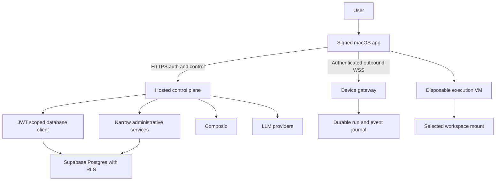
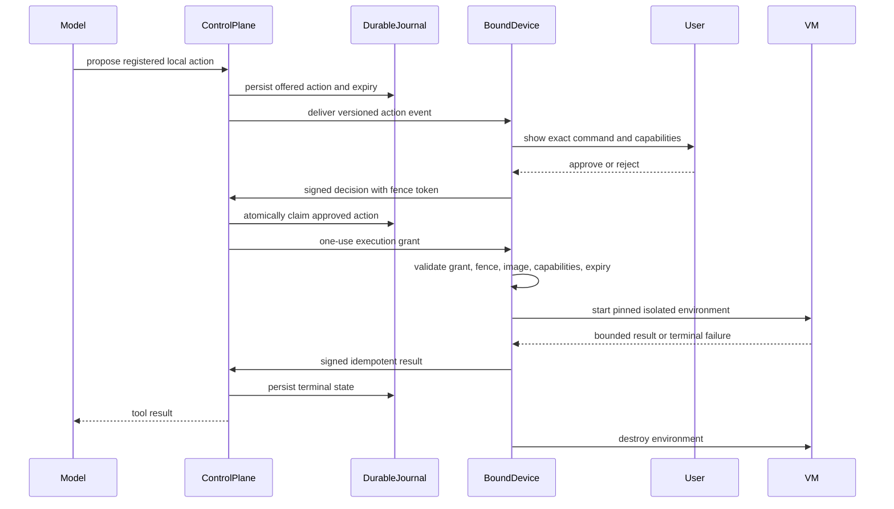
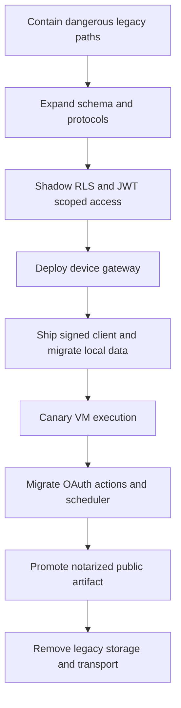

# fix: harden Perch for production

## Summary

Remove production remote-code-execution and cross-tenant paths, replace the localhost bridge with an authenticated outbound device channel, and confine local execution to an isolated VM. Establish reproducible database, macOS release, deployment, dependency, and accessibility gates before public launch.

## Problem Frame

The hosted backend can execute model-generated shell commands, tenant-owned data relies on service-role query discipline without RLS, and authenticated users can observe global in-memory tasks. External actions default to execution when classification fails. The macOS app exposes an unauthenticated socket, stores tokens and conversations in shared plaintext files, and cannot connect coherently to a hosted production backend.

Signup, scheduler updates, OAuth attempts, migrations, dependencies, signing, release publication, and site accessibility also lack production controls. These weaknesses combine: inexpensive account creation reaches powerful tools, process-local state leaks across users, and the release pipeline cannot prove that the shipped app or database matches the reviewed system.

---

## Requirements

### Execution and action boundaries

- R1. The hosted runtime must deny child-process creation and shell or user-supplied executable invocation at both application and deployment layers.
- R2. Local execution must run only inside a disposable Apple Containerization VM with pinned kernel, init, and image artifacts, bounded resources, selected mounts, network denied by default, and explicit disclosure before output leaves the device.
- R3. Local capabilities must use a versioned typed registry; an arbitrary shell is a separate high-risk action requiring exact, single-use consent.
- R4. Hosted external actions must use an exact versioned registry, and unknown tools, schemas, accounts, policy failures, or registry versions must deny execution.

### Tenant, identity, and local-data isolation

- R5. Ordinary tenant operations must use a caller-JWT Supabase client protected by RLS; public request processes must not possess a general service-role credential.
- R6. Every data surface must be classified as user-readable, user-writable, or server-authoritative; owner and state-machine policies must deny cross-account access and same-owner forged protocol transitions.
- R7. Signup must require Supabase email verification, a browser-hosted CAPTCHA proof, distributed abuse limits, and idempotent verified-user provisioning before trial access; provider spend, enrollment, OAuth, schedules, actions, and journal growth must also have fail-closed quotas.
- R8. Access tokens, refresh tokens, and device private keys must live in the Data Protection Keychain; local conversations and account data must be partitioned by immutable user ID.

### Device and run protocol

- R9. The macOS app must enroll a non-exportable device key after fresh user authentication, then connect outbound over `wss://` using an HTTPS-issued one-use ticket, signed challenge, connection fencing, payload limits, heartbeat, rotation, device limits, and revocation.
- R10. Runs, events, local-action requests, approvals, execution grants, acknowledgements, cancellation, and terminal results must be durable and owner/device scoped; a VM may start only from a one-use grant bound to the claimed action, capabilities, image, device, fence, and expiry.
- R11. Delivery must be at-least-once with idempotent reducers, ordered per-device sequences, a retained replay window, and snapshot resynchronization after retention expires.
- R12. A run requiring local execution must bind to its initiating device with no silent failover; logout or revocation fences the socket and cancels unstarted device work.

### OAuth, actions, and scheduling

- R13. Composio linking must use a pinned supported link API, PKCE where controlled by Perch, exact hosted HTTPS callbacks, one-time state bound to a user/device/app attempt, scope minimization, identifier retention limits, and non-destructive replacement.
- R14. Pending actions must bind immutable normalized parameters to one owner, account, registry version, expiry, and terminal decision; each registry entry must declare provider-specific idempotency, retry, and reconciliation semantics.
- R15. Scheduler mutations must use validated allowlisted fields, and execution must use durable leases so replicas cannot duplicate runs or execute local commands on the server.

### Release and operations

- R16. Production configuration must use validated HTTPS/WSS origins, Node 24 LTS, pinned supported Supabase and Composio baselines, separate least-privilege secret identities, rotation and revocation procedures, log redaction, and no insecure fallback.
- R17. Ordered migrations must bootstrap a clean database, use checksums and locking, verify without mutation, test RLS, and follow expand/migrate/contract rollout.
- R18. CI must block from the first hardening unit on backend, site, and Swift checks; tenant and protocol integration tests; lockfile and dependency review across npm, Swift, CI actions, and VM artifacts; SBOM/provenance; secret scanning; migration verification; and release-policy checks.
- R19. The macOS app and nested services must use Developer ID signing, Hardened Runtime, notarization, stapling, Gatekeeper verification, checksums, and provenance before publication.
- R20. Notarized immutable artifacts must publish to Vercel Blob before the site enables download; private source and issue links must not appear publicly.
- R21. The site must have zero blocking axe violations and meet WCAG 2.2 AA contrast, keyboard, focus, target, and reduced-motion criteria; the app must complete a release matrix for keyboard navigation, VoiceOver labels/order, contrast, reduced motion, and status announcements.

---

## Key Technical Decisions

- KTD1. **Hosted control plane, local execution plane:** Express owns identity, providers, scheduling, policy, and durable run state. The macOS app owns device consent and VM execution; the backend has no compatibility fallback for shell execution.
- KTD2. **Strong isolation without discarding safe features:** The main app retains its existing supported macOS range for chat, monitoring, stats, and hosted workflows. A separately availability-gated macOS 26 Apple-silicon executor target uses Apple Containerization; unsupported systems receive no weaker execution fallback.
- KTD3. **Least-privilege VM defaults:** A user-selected workspace is mounted read-only and may contain secrets; consent names the mounted scope and remote-output disclosure. Sensitive-file detection warns or denies, and network/write elevation requires a new parameter-bound approval.
- KTD4. **Separated database identities:** Request handlers use a publishable key plus caller JWT so RLS is authoritative. Privileged bootstrap, webhook, scheduler, fencing, and reconciliation run under separate operation-specific roles or workers that cannot perform arbitrary table access.
- KTD5. **Durable device protocol:** HTTPS challenge and enrollment bind the device key, HTTPS mints a signed one-use upgrade ticket, and WSS atomically consumes it while advancing the fence. Database state and one-use execution grants, not socket delivery, determine action and run outcomes.
- KTD6. **Initiating-device affinity:** Local work stays bound to the Mac that initiated the run. Offline work enters an expiring `waiting_for_device` state rather than moving to another device.
- KTD7. **Exact action policy:** Models propose actions but cannot authorize them. A registry entry fixes schema, execution location, consent, scopes, target constraints, idempotency, timeout, and redaction.
- KTD8. **Safe compatibility floor:** One release of backward readability applies only to the authenticated device protocol. The unauthenticated localhost bridge is never supported by the hosted control plane, and rollback cannot select an artifact that retains plaintext credentials or port 7778.
- KTD9. **Private development, public binaries:** Source and issue links are removed. CI publishes immutable notarized archives, checksums, and provenance to Vercel Blob through a protected release environment.
- KTD10. **Developer ID outside the App Sandbox:** The main app uses Hardened Runtime and minimum reviewed entitlements but does not claim App Sandbox compatibility while process monitoring and Music automation remain. The VM, not the main app sandbox, contains local command execution.
- KTD11. **Honest run recovery:** Tool boundaries and durable events are checkpointed, but an interrupted provider stream becomes an explicit recoverable terminal state unless the provider supports safe continuation. User-driven retry creates a new run rather than pretending exactly-once continuation.

---

## High-Level Technical Design

---

## Scope Boundaries

### In scope

- All validated security, tenant-isolation, device transport, local execution, signup, OAuth, scheduler, dependency, packaging, deployment, site-link, asset, and accessibility findings.
- Data and protocol migrations needed to move existing accounts and clients safely.
- Release observability, rollback, audit, and operator verification required to enforce the new boundaries.
- Regression gates for the authenticated-chat and strict payment-entitlement controls delivered by `docs/plans/2026-07-10-001-fix-production-smoke-remediation-plan.md`; this plan is additive and supersedes only overlapping OAuth, action, migration, and release work.

### Deferred to Follow-Up Work

- Horizontal device-gateway scaling and shared pub/sub beyond one production replica.
- Native macOS arbitrary command execution outside the VM.
- App Store distribution, auto-update infrastructure, and open-sourcing the private repository.
- New product features unrelated to the audited production flows.

---

## Implementation Units

### U1. Contain exploitable legacy paths

- **Goal:** Remove immediate hosted execution and cross-account/action-policy vulnerabilities before building replacement infrastructure.
- **Requirements:** R1, R4, R10, R13–R16, R18.
- **Dependencies:** None.
- **Files:** `.github/workflows/security-baseline.yml`, `backend/Dockerfile`, `backend/render.yaml`, `backend/src/tools/local.ts`, `backend/src/agent/runner.ts`, `backend/src/actions/allowlist.ts`, `backend/src/actions/registry.ts`, `backend/src/routes/tasks.ts`, `backend/src/routes/scheduled.ts`, `backend/src/routes/auth.ts`, `backend/src/composio/connection.ts`, `backend/src/types.ts`, `backend/src/security/no-host-process-execution.test.ts`, `backend/src/actions/registry.test.ts`, `backend/src/agent/runner.test.ts`, `backend/src/routes/tasks.test.ts`, `backend/src/routes/scheduled.test.ts`, `backend/src/composio/connection.test.ts`.
- **Approach:** Remove `bash_execute` and every backend process-execution import. Run the production service under the Node permission model without child-process permission in a minimal non-root image with no shell/toolchain, read-only filesystem, dropped privileges, and constrained egress. Replace verb classification with the minimal exact registry that U6 will extend. Add immutable task ownership, server-issued IDs, owner-scoped accessors, and allowlisted scheduler updates as containment pending durable run migration. Move Composio from the retired initiate flow to a pinned link baseline without deleting working connections. Freeze public signup, new trials, and costly integrations until verified provisioning and distributed quotas ship, while retaining capability-limited safe service for existing verified users. Establish baseline CI for tests, lockfiles, audits, migrations, and protocol schemas before later units deploy.
- **Execution note:** Write adversarial tests first for shell exposure, cross-user task reads/collisions, unknown external actions, and protected scheduler columns.
- **Patterns to follow:** Existing Node test runner in `backend/package.json`; pending-action ownership checks in `backend/src/actions/pending.ts`.
- **Test scenarios:**
  - Authenticated chat cannot expose or invoke any hosted process executor, including through an unknown tool name.
  - User A cannot list, fetch, update, or collide with user B’s in-memory task.
  - Every curated Composio action is classified; unknown, version-mismatched, or metadata-failed actions deny.
  - Scheduler PATCH accepts documented editable fields and rejects ownership, ID, result, count, and execution-time fields.
  - Representative direct, dynamic, and dependency-mediated process launches fail in the production-equivalent runtime.
  - Existing strict payment and authenticated-chat tests remain release-blocking.
- **Verification:** Source checks and runtime policy jointly enforce no hosted process execution, and all temporary task/action/scheduler boundaries fail closed.

### U2. Establish reproducible schema and tenant isolation

- **Goal:** Make a clean database reproducible and make RLS authoritative for ordinary user operations.
- **Requirements:** R5, R6, R17, R18.
- **Dependencies:** U1.
- **Files:** `backend/schema.sql`, `backend/sql/000_base_schema.sql`, `backend/sql/005_rls_and_constraints.sql`, `backend/scripts/migrate.mjs`, `backend/src/lib/supabase.ts`, `backend/src/lib/user-db.ts`, `backend/src/lib/admin-db.ts`, `backend/src/middleware/auth.ts`, tenant-facing files under `backend/src/routes/`, `backend/src/db/migrations.integration.test.ts`, `backend/src/db/rls.integration.test.ts`, `backend/src/db/admin-operation-matrix.test.ts`.
- **Approach:** Treat ordered migrations as authoritative and generate `backend/schema.sql` as a snapshot. Fingerprint and baseline existing databases before introducing `000`, record checksums under an advisory lock, and make verify read-only. Migrate to publishable/secret keys here. Add immutable owner constraints, explicit grants, user-write versus server-authoritative classifications, `USING` plus `WITH CHECK` policies, and indexed owner columns. Convert ordinary routes to caller-JWT clients; move privileged operations to separately credentialed roles/workers and fixed-search-path RPCs.
- **Execution note:** Characterize every current table/query first, then add cross-tenant tests before enabling each policy.
- **Patterns to follow:** Existing owner predicates in backend routes; ordered migration ledger in `backend/scripts/migrate.mjs`.
- **Test scenarios:**
  - A clean database migrates from zero and a second run changes nothing.
  - Verify detects missing, changed, or drifted migrations without creating or changing database objects.
  - Anonymous, expired, user A, and user B contexts enforce read, insert, update, delete, and forged-owner denial.
  - A valid owner cannot forge approval, acknowledgement, sequence, result, fence, or terminal-state transitions.
  - Administrative bootstrap, webhook, scheduler claim, fencing, and reconciliation identities can perform only their operation matrix, while a compromised public route cannot obtain unrestricted access.
  - An existing manually bootstrapped database can be fingerprinted and baselined without recreating objects or accepting unknown drift.
- **Verification:** CI can reset a database, apply migrations, pass pgTAP/integration isolation tests, and prove ordinary request paths do not use the secret client.

### U3. Add durable runs and protocol state

- **Goal:** Replace process-local task state with durable owner/device-scoped runs, events, actions, grants, and reducers.
- **Requirements:** R5, R6, R10–R12, R17, R18.
- **Dependencies:** U2.
- **Files:** `backend/sql/006_devices_runs_events.sql`, `backend/src/agent/runner.ts`, `backend/src/protocol/run-state.ts`, `backend/src/protocol/schemas.ts`, `backend/src/types.ts`, `backend/src/agent/runner.integration.test.ts`, `backend/src/protocol/run-state.test.ts`, `backend/src/protocol/schemas.test.ts`.
- **Approach:** Persist devices, runs, ordered events, acknowledgements, action requests, one-use execution grants, cancellation, and terminal results under server-authoritative policies. Define versioned state transitions and checkpoint only restart-safe boundaries. Interrupted provider streams become explicit recoverable terminal states.
- **Execution note:** Build state-transition, idempotency, forged-owner, and interruption tests before replacing in-memory state.
- **Patterns to follow:** Authenticated REST middleware; durable pending-action terminal transitions.
- **Test scenarios:**
  - Duplicate or out-of-order events and results leave one valid durable transition.
  - A valid owner cannot forge acknowledgements, approvals, grants, results, sequences, or terminal states.
  - Restart at a safe checkpoint resumes journal delivery; interruption during provider streaming records a recoverable terminal state rather than replaying uncertain work.
  - Cancellation, expiry, and terminal transitions reject late actions and results.
- **Verification:** Process restart preserves authoritative run state without cross-user leakage, fabricated transitions, or duplicate side effects.

### U9. Enroll devices and authenticate the fenced gateway

- **Goal:** Bind device keys to verified accounts and establish one current authenticated connection generation per device.
- **Requirements:** R5, R6, R9, R10, R12, R16–R18.
- **Dependencies:** U3.
- **Files:** `backend/src/app.ts`, `backend/src/index.ts`, `backend/src/config.ts`, `backend/src/routes/devices.ts`, `backend/src/events/device-gateway.ts`, `backend/src/routes/devices.test.ts`, `backend/src/events/device-gateway.test.ts`.
- **Approach:** Require fresh account authentication to enroll a bounded number of non-exportable device keys. Issue HTTPS challenges and signed one-use upgrade tickets, pass tickets in WSS headers, atomically consume them while advancing the fence, derive identity from the connection, and enforce heartbeat, revocation, payload, message, and byte limits.
- **Execution note:** Write enrollment, ticket-replay, stale-fence, and revocation-race tests before accepting application messages.
- **Patterns to follow:** Auth middleware and owner-scoped protocol state from U3.
- **Test scenarios:**
  - Expired, reused, wrong-user, wrong-device, revoked, or unsigned tickets cannot establish a session.
  - Duplicate enrollment, key replacement, account switching, device-limit exhaustion, and revocation races preserve one authoritative key binding.
  - A newer fence invalidates the old socket and rejects its late messages, acknowledgements, and results.
  - Malformed, oversized, flooded, unsupported-version, or backpressured clients disconnect without affecting another user.
- **Verification:** The gateway accepts only freshly authenticated enrolled devices and enforces the current fence for every message.

### U10. Add replay, resynchronization, and recovery

- **Goal:** Make gateway disconnects and restarts recoverable without claiming exactly-once delivery.
- **Requirements:** R10–R12, R18.
- **Dependencies:** U9.
- **Files:** `backend/src/events/device-gateway.ts`, `backend/src/protocol/replay.ts`, `backend/src/routes/runs.ts`, `backend/src/protocol/replay.test.ts`, `backend/src/routes/runs.test.ts`, `backend/src/events/device-gateway.recovery.test.ts`.
- **Approach:** Replay retained per-device sequences at least once from a persisted cursor, deduplicate through durable transition IDs, and return an authorized snapshot after retention expires. Add distributed reconnect/storage quotas, jittered backoff contracts, waiting-device expiry, explicit cancellation, and one-use execution grants emitted only after an atomic claim.
- **Execution note:** Test disconnection at every acknowledgement and grant boundary before wiring client recovery.
- **Patterns to follow:** Durable state transitions from U3 and fenced connections from U9.
- **Test scenarios:**
  - Disconnect and gateway restart replay retained events without duplicate state or execution.
  - Cursor expiry produces an owner-authorized snapshot and a new cursor.
  - Approval races with cancellation, expiry, revocation, or a newer fence cannot mint a valid grant.
  - A grant is parameter-bound, single-use, and rejected after cancellation, expiry, or fence change.
  - An offline initiating device enters a visible expiring wait without automatic failover.
- **Verification:** Recovery tests prove at-least-once transport, idempotent durable outcomes, and bounded storage/reconnect behavior.

### U4. Secure macOS identity, storage, and outbound connectivity

- **Goal:** Migrate the app from plaintext shared files and inbound localhost sockets to account-partitioned storage and authenticated outbound WSS.
- **Requirements:** R8–R12, R16.
- **Dependencies:** U10.
- **Files:** `app/Perch.xcodeproj/`, `app/Perch.entitlements`, `app/Sources/AuthManager.swift`, `app/Sources/SecureSessionStore.swift`, `app/Sources/AccountDataStore.swift`, `app/Sources/DeviceIdentityStore.swift`, `app/Sources/DeviceConnection.swift`, `app/Sources/LocalConversationStore.swift`, `app/Sources/NotchViewModel.swift`, `app/Sources/WebSocketServer.swift`, `app/Tests/PerchTests/SecureSessionStoreTests.swift`, `app/Tests/PerchTests/AccountDataStoreTests.swift`, `app/Tests/PerchTests/DeviceConnectionTests.swift`, `app/Tests/PerchTests/EventRoutingTests.swift`.
- **Approach:** Establish the Xcode targets, Hardened Runtime baseline, development signing, and reviewed entitlement manifest before internal client rollout. Store session and non-exportable device credentials in the Data Protection Keychain. Move conversations and account state under Application Support partitions with atomic restrictive files. Migrate legacy data only after verifying the active user, clear memory before account switches, remove the local listener, and implement cancellable WSS lifecycle, cursor persistence, deduplication, sleep/wake recovery, logout fencing, and protocol-upgrade UX. Map offline, expired, revoked, interrupted, reenrollment, retry, and account-switch states to visible actions and durable recovery.
- **Execution note:** Start with migration crash/retry and account-switch leakage tests before changing persisted formats.
- **Patterns to follow:** Existing serial conversation-store queue; token-refresh flow in `AuthManager`.
- **Test scenarios:**
  - A successful legacy migration imports one matching account, verifies the new stores, and removes plaintext secrets; interruption retries without duplication or loss.
  - Account B never renders or sends account A’s conversations during login, logout, switching, or failed refresh.
  - Keychain duplicate, interaction-denied, missing, rotated, and deleted credential states produce recoverable UI.
  - Sleep/wake, network change, ticket loss, reconnect, cursor replay, revocation, and unsupported protocol versions reach explicit states.
  - Offline and revoked devices show identity, reason, expiry, reconnect progress, cancel/retry actions, and accessible status announcements without silent failover.
  - Account switching identifies the active account and safely resolves or cancels drafts, runs, and device sessions before new-account content loads.
- **Verification:** Plaintext token files are absent, account partitions remain isolated, and the app reconnects outbound to the hosted gateway without opening port 7778.

### U5. Build the VM-backed local executor

- **Goal:** Restore useful local execution without granting the hosted backend or native app unrestricted host access.
- **Requirements:** R1–R3, R10–R12, R19.
- **Dependencies:** U10, U4.
- **Files:** `app/Package.swift`, `app/Perch.xcodeproj/`, `app/Perch.entitlements`, `app/Executor.entitlements`, `app/Sources/Executor/ActionRegistry.swift`, `app/Sources/Executor/ExecutionConsent.swift`, `app/Sources/Executor/ContainerRuntime.swift`, `app/Sources/Executor/WorkspaceAccess.swift`, `app/Sources/Executor/ExecutionResult.swift`, `app/Resources/ExecutorArtifacts.json`, `app/Tests/PerchTests/LocalActionRegistryTests.swift`, `app/Tests/PerchTests/ExecutionConsentTests.swift`, `app/Tests/PerchTests/ContainerRuntimeTests.swift`, `app/Tests/PerchTests/WorkspaceAccessTests.swift`.
- **Approach:** Pin Apple Containerization and provision signed/checksummed kernel, init, and OCI image artifacts with explicit cache/bootstrap behavior and virtualization entitlement. Use digest-pinned disposable Linux VMs, explicit security-scoped workspace mounts, no host home or implicit credentials, read-only/no-network defaults, bounded CPU/memory/disk/process/output/time, whole-workload cancellation, cleanup, and signed fenced results. Resolve symlinks, hard links, nested mounts, sockets, and concurrent path changes at the trust boundary. Typed operations are normal; shell requires separate exact consent, and any write, egress, sensitive-file transmission, or result disclosure elevation requires a new approval.
- **Execution note:** Implement registry and isolation-policy tests before wiring execution; test escape boundaries on supported Apple-silicon hardware.
- **Patterns to follow:** Exact hosted action registry from U1; device action state machine from U3.
- **Test scenarios:**
  - Unknown action, image digest mismatch, stale bookmark, symlink escape, unapproved write/network request, or wrong fence cannot start a VM action.
  - Approved read-only typed work and approved high-risk shell work receive only the selected scope and documented environment.
  - Representative repository analysis and test execution complete read-only; controlled writes and allowlisted dependency access require one clear elevation and produce reviewable output.
  - First-use readiness explains VM isolation, artifact size/progress, workspace scope, unavailable capability, stale permission, and what result data may leave the device.
  - Timeout, cancellation, app quit, VM crash, resource exhaustion, and result-ack loss terminate the workload and remain idempotently recoverable.
  - Nothing outside the approved mount is visible; secret files, sockets, path swaps, IPv4/IPv6/DNS egress, hostile output, and renderer injection follow explicit deny/redaction/consent policy.
- **Verification:** A clean supported Mac completes a consented bounded action inside a verified disposable VM, while the documented hardware-backed escape, exfiltration, resource, and cleanup threat tests fail safely.

### U6. Harden signup, OAuth, external actions, and scheduling

- **Goal:** Make identity and third-party workflows durable, owner-bound, fail-closed, and retry-safe.
- **Requirements:** R4–R7, R13–R18.
- **Dependencies:** U2, U3, U4.
- **Files:** `backend/src/routes/auth.ts`, `backend/src/routes/apps.ts`, `backend/src/composio/connection.ts`, `backend/src/composio/tools.ts`, `backend/src/actions/registry.ts`, `backend/src/actions/pending.ts`, `backend/src/scheduler/index.ts`, `backend/sql/007_identity_oauth_actions_scheduler.sql`, `app/Sources/Views/OnboardingView.swift`, `backend/src/routes/auth.test.ts`, `backend/src/routes/apps.test.ts`, `backend/src/composio/connection.test.ts`, `backend/src/actions/pending.test.ts`, `backend/src/scheduler/index.test.ts`, `app/Tests/PerchTests/OnboardingAuthTests.swift`.
- **Approach:** Replace admin auto-confirm with public verified signup, hosted browser CAPTCHA proof, generic responses, distributed proxy-aware capability quotas, and idempotent provisioning. Define browser return, check-email, resend/change-email, expired-link, cross-device verification, reopening, and provisioning-repair states. Complete the pinned Composio migration started in U1, use parallel linking for replacement, bind one active attempt per user/app, minimize scopes/identifiers, and preserve a working account until replacement succeeds. Extend U1’s exact registry with immutable pending-action claims and provider-specific delivery semantics; non-queryable ambiguous outcomes become terminal reconciliation work. Use scheduler lease transactions with explicit retry, expiry, cancellation, poison-task states, and visible hosted-versus-device-local schedule classification.
- **Execution note:** Add lifecycle tests for partial provisioning, stale OAuth callbacks, duplicate approval, and scheduler failover before replacing current flows.
- **Patterns to follow:** Payment webhook trust boundary; existing pending-action state model; owner predicates from U2.
- **Test scenarios:**
  - CAPTCHA-less, unverified, configured-blocklist, rate-limited, or partially provisioned signup cannot receive a trial or tool access.
  - Quota-store outage denies costly signup, provider, enrollment, OAuth, scheduler, action, and replay/storage operations rather than failing open.
  - Verified provisioning retries produce one profile and app bootstrap without requiring another signup.
  - Forged, reused, expired, cancelled, cross-user, cross-device, or superseded OAuth state cannot activate an account.
  - Failed reconnect preserves the previous usable account; Composio outage does not become disconnected.
  - Duplicate/late action decisions and ambiguous provider results never create an automatic second attempt.
  - Competing scheduler replicas claim a task once, recover expired leases, and queue local work for the bound device without server execution.
- **Verification:** End-to-end test accounts can verify, link, approve, schedule, reconnect, and recover without cross-account state or duplicate side effects.

### U7. Upgrade and harden the production runtime

- **Goal:** Remove vulnerable/obsolete dependency paths and make hosted operation observable and fail-safe.
- **Requirements:** R16–R18.
- **Dependencies:** U1–U6, U9, U10.
- **Files:** `backend/package.json`, `backend/package-lock.json`, `backend/tsconfig.json`, `backend/src/app.ts`, `backend/src/index.ts`, `backend/src/config.ts`, `backend/.env.example`, `backend/render.yaml`, `site/package.json`, `site/package-lock.json`, `backend/src/config.test.ts`, `backend/src/health.test.ts`, `README.md`, `AGENTS.md`.
- **Approach:** Standardize CI and production on Node 24 LTS, keep Express 4 on its latest supported patch during this hardening effort, remove unused dependency trees, and finish direct dependency upgrades after the Supabase/Composio baselines established earlier. Add strict schemas/body limits, trusted-proxy configuration, security headers, liveness/readiness separation, graceful drain, redacted correlated logging, secret-class ownership/rotation/revocation, and production configuration validation. Generate SBOMs and pin CI actions and VM artifacts.
- **Execution note:** Characterize runtime and dependency contracts before upgrades and update one dependency family at a time.
- **Patterns to follow:** Existing typed ESM imports and health route; current environment-driven config.
- **Test scenarios:**
  - Startup fails for HTTP origins, localhost production endpoints, legacy/insecure secret fallbacks, or missing required configuration.
  - Readiness fails for migration, database, gateway, or critical provider prerequisites while liveness remains process-focused.
  - SIGTERM stops intake, fences/drains sockets and jobs, and exits by deadline without duplicate work.
  - Dependency review blocks newly introduced high/critical advisories; accepted residual transitive risk requires a documented reachability exception.
- **Verification:** Supported production builds run on Node 24 with current APIs, no unused critical dependency tree, passing audit policy, and actionable health/telemetry.

### U8. Establish signed release, deployment, site, and accessibility gates

- **Goal:** Publish only verified production artifacts and prevent broken or inaccessible public surfaces.
- **Requirements:** R17–R21.
- **Dependencies:** U2–U7, U9, U10.
- **Files:** `.github/workflows/security-baseline.yml`, `.github/workflows/ci.yml`, `.github/workflows/release-macos.yml`, `.github/dependabot.yml`, `app/build.sh`, `app/Perch.xcodeproj/`, `app/Perch.entitlements`, `site/public/`, `site/src/components/site-config.ts`, `site/src/components/Download.tsx`, `site/src/components/Footer.tsx`, `site/src/components/Features.tsx`, `site/src/PerchSite.tsx`, `site/src/index.css`, `site/vercel.json`, `site/src/components/site-config.test.ts`, `site/tests/marketing.spec.ts`, `site/tests/accessibility.spec.ts`, `docs/runbooks/database-rollout.md`, `docs/runbooks/device-protocol-rollout.md`, `docs/runbooks/macos-release.md`, `docs/runbooks/security-rollback.md`.
- **Approach:** Extend the baseline gate from U1 into pinned least-privilege jobs for backend, site, Swift, clean migrations/RLS, dependency review, secret scanning, protocol compatibility, artifact inspection, and entitlement-manifest comparison. Protected release CI imports Developer ID credentials into a temporary Keychain, signs inside-out with Hardened Runtime, notarizes, staples, verifies, checksums, attests, scans archives for credentials/debug material, and uploads content-addressed immutable artifacts to Vercel Blob. Promotion is a new atomic site deployment referencing a versioned manifest, not a mutable Blob overwrite. Remove private source/issues links; add public support, changelog, security architecture, and vulnerability-reporting destinations. Gate release on assets, links, zero blocking axe findings, keyboard, reduced-motion, contrast, reproducible VoiceOver task completion, and clean-machine install evidence.
- **Execution note:** Build the unsigned test pipeline first, then exercise signing and publication in a protected prerelease environment before enabling the public CTA.
- **Patterns to follow:** Existing site build/lint scripts; `site/src/components/site-config.ts` as the external-link source of truth.
- **Test scenarios:**
  - Pull requests cannot access release secrets and fail on broken builds, migrations, RLS, links/assets, protocol schemas, new dependency risk, or automated accessibility violations.
  - Release refuses ad-hoc, unsigned, incorrectly entitled, unnotarized, unstapled, Gatekeeper-rejected, or checksum-mismatched artifacts.
  - A published version is immutable; rollback repoints the stable manifest to a prior notarized artifact rather than overwriting bytes.
  - Anonymous visitors can download the promoted artifact without repository access and cannot reach private Source, GitHub, or Issues destinations.
  - Keyboard, screen-reader, focus, contrast, reduced-motion, and native VoiceOver test records cover representative onboarding, chat, approval, settings, and failure states.
  - Download UI discloses system requirements, architecture, version, size, integrity metadata, installation guidance, unsupported-system behavior, and damaged-download recovery.
- **Verification:** A clean Mac downloads from the public site, verifies and launches the notarized app, enrolls its device, reconnects, and completes a VM-backed action; all release gates retain evidence.

---

## Acceptance Examples

- AE1. Given authenticated users A and B, when each exercises every tenant route and direct Data API operation, then neither can observe or mutate the other’s rows, runs, devices, events, actions, or local history.
- AE9. Given a valid owner JWT, when it attempts to forge an approval, acknowledgement, result, sequence, fence, or terminal state directly, then database privileges and transition guards reject it.
- AE2. Given a device reconnects while an older socket remains alive, when the new fence is committed, then all later acknowledgements or results from the old socket are rejected.
- AE3. Given a model proposes an unknown action or a known shell action without exact consent, when policy evaluates it, then no hosted or local execution begins.
- AE4. Given an approved VM action, when it requests an unapproved write, network destination, host path, credential, sensitive-file disclosure, hostile output, or excess resource, then the VM denies, redacts, or terminates it and records a bounded failure.
- AE5. Given a replacement OAuth flow fails or returns stale state, when status is reconciled, then the previous connected account remains usable and no new account activates.
- AE6. Given an existing user switches accounts after local-data migration, when the new session loads, then previous-account content never renders or leaves the device under the new identity.
- AE7. Given two scheduler replicas and one due task, when both poll concurrently, then one lease wins and at most one remote or queued local attempt is created.
- AE8. Given a release candidate fails signing, notarization, migration, isolation, dependency, link, asset, or accessibility policy, when release CI runs, then no artifact is promoted and no stable download deployment changes.

---

## System-Wide Impact

The plan changes the core trust boundary: models and hosted services may propose work, but only authenticated owner-scoped policy and the bound device may authorize local capability. Durable runs and events become shared infrastructure for chat, schedules, OAuth, approvals, notifications, and reconnect recovery.

Database and protocol rollout must be expand/contract. The old app cannot use the new hosted topology, while the new app must never fall back to localhost backend execution. Production remains single-replica until a shared gateway pub/sub layer is implemented, but all durable state and fencing must already be replica-safe.

---

## Risks and Dependencies

- **Apple Containerization:** The executor requires macOS 26 on Apple silicon, while the main app keeps its existing compatibility floor. Kernel/init/image provenance, virtualization entitlement, availability isolation, and hardware-backed adversarial tests are prerequisites.
- **Composio migration:** The installed SDK predates current link/session APIs. Upgrade in staging and contract-test every curated action and connected-account transition.
- **RLS rollout:** Enabling policies before route conversion causes outages; converting clients before policy/grant verification can leave a false sense of isolation.
- **Swift/Xcode migration:** The Developer ID app remains outside App Sandbox for this release because current process monitoring and Music automation conflict with it. Hardened Runtime, least entitlements, VM isolation, and archive inspection remain mandatory.
- **Device protocol:** At-least-once delivery and schema compatibility require idempotent reducers and retained executors for pending older-version actions.
- **Secrets:** Apple signing credentials, Vercel Blob credentials, Supabase secret keys, provider keys, and OAuth credentials require protected environments and rotation runbooks.
- **Dependency policy:** Audit severity is not reachability. Exceptions must be narrow, expiring, and documented rather than forcing unsafe automated upgrades.

---

## Phased Delivery and Rollback

1. Freeze public signup/trials and costly integrations, establish baseline CI, and contain hosted shell execution, cross-user tasks, retired Composio initiation, fail-open actions, and scheduler mass assignment.
2. Expand schema, add RLS tests, and shadow caller-JWT access before revoking broad paths.
3. Deploy durable runs and the device gateway with local execution disabled.
4. Ship a signed internal client that migrates Keychain/account data and uses outbound WSS.
5. Canary the VM executor on internal devices and expand registry capabilities individually.
6. Migrate signup, OAuth, external actions, and scheduler leases.
7. Publish a notarized prerelease, verify a clean-machine flow, then promote and update the site.
8. Contract compatibility code only after the one-release window, zero observed legacy authenticated connections for the documented monitoring period, complete migration verification, and a tested safe-artifact rollback.

Rollback may disable new capabilities or deploy a prior notarized artifact above the minimum safe client floor, but must not restore hosted command execution, unauthenticated sockets, plaintext credential storage, broad tenant access, or fail-open actions. Pre-hardening credentials and device tickets are revoked when the new protocol is enforced.

---

## Documentation and Operational Notes

- Keep operation matrices for database access, action policy, protocol states, and release credentials under `docs/runbooks/`.
- Record minimum client protocol and capability requirements in API responses and release notes.
- Document device enrollment/removal, local-data removal, action reconciliation, migration rollback, certificate compromise, Vercel Blob promotion, and security incident response.
- Update `README.md` and `AGENTS.md` when test, topology, signing, and migration claims become true.

---

## Sources and Research

- Existing remediation context: `docs/plans/2026-07-10-001-fix-production-smoke-remediation-plan.md`
- Supabase RLS and key guidance: https://supabase.com/docs/guides/database/postgres/row-level-security and https://supabase.com/docs/guides/getting-started/api-keys
- PostgreSQL row security: https://www.postgresql.org/docs/current/ddl-rowsecurity.html
- OWASP WebSocket Security: https://cheatsheetseries.owasp.org/cheatsheets/WebSocket_Security_Cheat_Sheet.html
- OWASP AI Agent Security: https://cheatsheetseries.owasp.org/cheatsheets/AI_Agent_Security_Cheat_Sheet.html
- OAuth native-app and security guidance: https://www.rfc-editor.org/rfc/rfc8252.html and https://datatracker.ietf.org/doc/html/rfc9700.html
- Apple Containerization: https://github.com/apple/Containerization
- Apple App Sandbox and notarization: https://developer.apple.com/documentation/security/app-sandbox and https://developer.apple.com/documentation/security/notarizing-macos-software-before-distribution
- Composio link migration: https://docs.composio.dev/docs/auth-configuration/migrating-initiate-to-link
- GitHub Actions security: https://docs.github.com/en/actions/reference/security/secure-use
- WCAG 2.2: https://www.w3.org/TR/WCAG22/
